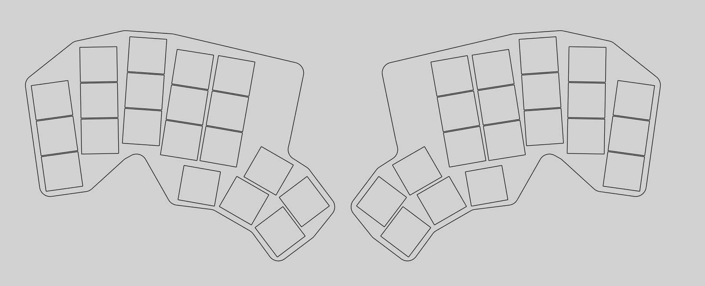

**Total time: ~16 hr**
---

## July 3rd [2025-06-03]
**~3 hrs**

Idea was conceptualized today and most of the engineering goals were set. theyre also decribed in the readme

engineering goals: 
- low profile
- split, column stagger; perfectly ergonomic for my habds
- wireless (bluetooth) and thus battery powered
- silent for use in shared spaces
- USB C charger
- OLED starys screen for modes and stats
- sculpted and colored keycaps (no text)
- retro techy look: lots of clear plastic (resin printing?)

I also decided on the following tools: 
- Ergopad: finger spacing and splay
- Ergogen: key placement, pcb, outline, etc
- KiCad: PCB
- inkscape: svg and dxf editing for laser cut
- fusion 360: (optional) 3d modelling

inspiration comes from the following: 

## July 4th [2025-06-04]
**~0.5 hr**

Happy 4th of July! Not much got done today, laid out stagger and splay in ergopad. see below. 

## July 5th [2025-06-05]
**~1.5 hrs**

Learned a lot of ergogen's point syntax (using documentation :/) and laid out the full set of keys. Forty keys witha thimb cluster and a very basic preview. 
The syntax is pretty intuitive and its very good for explicityly declaring relative positioning. 
Considering a Miryoki inspirated layer layout, but im not sure how to code with only 40 keys. 

found FlatFootFox's tutorial to lay out an outline as well for the board. 

## July 6th [2025-06-06]
**~5 hrs**

FlatFootFox's tutorial now has goat status. I was able to layout the full PCB with footprints and link contacts for KiCad. Spent a few more hours routing the board. Its a little messy but uotimately effective. Thanks to the pathfinder ysws for teaching me kicad. 
Going to add some nice groahics on the sikscreen and start considering cases. 
i wanted clear casing, so cutting clear acrylic may work but itll be aurd to achieve the tent. If i want to use 18650 cells it also requies additonal modelling wotk to make the round suape and requires 3d printing. Maybe its time to hop back in fusion 360 and design the bottom of the case out of clear plastic for 3D printing. Top still should be clear acrylic hopefully and similar translucence for the keycaps. 
This means I have to consider adding mounting holes and also checking how the 18650 will get the right connector. 

## July 7th [2025-06-07]
**~6 hrs**

Working on the PCB more. Adding 3d models for switches and buttons as well as for the nicenano and display. New decisions about the case: no top plate. CLear resin printing to make a bowl of sorts for the bottom and then use screws to mount the board to said bowl. This simplifies the case and manufacturing, saves money while achiving the same techy look. 

Also finished the case. It's designed to accommodate and 18650 which becomes tent and allows the board to be mounted via M3 screws. See below for the case. I was going to use Fusion 360, but OnShape had a Wakatime plugin, but I also couldn't get it to work. 

Went for a relatively simple keycap saddle design for easy movement of fingers. Also desinged in onshape. 

