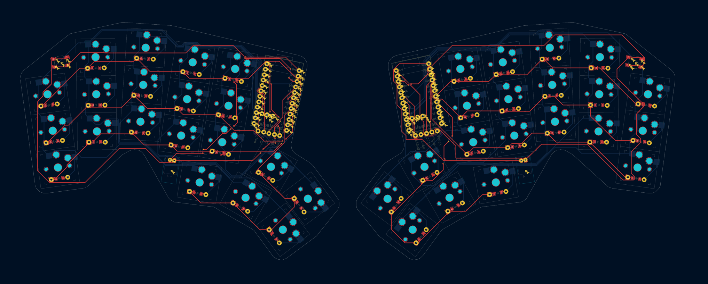
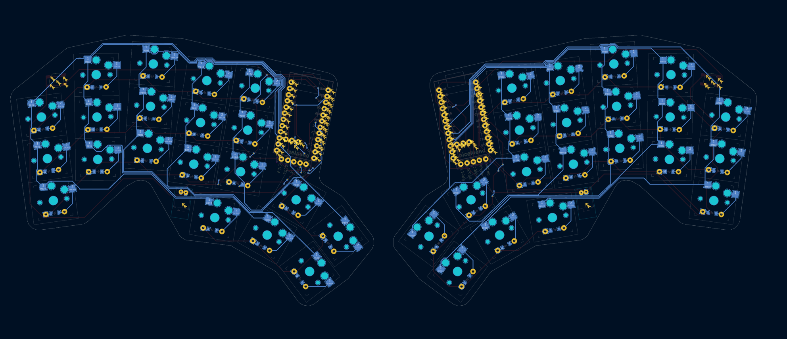

# banana split
A split, tented keyboard with columnar staggering. Designed from scratch with ergogen, KiCad, and Fusion 360, and fully open-source. 
Runs on 18650 batteries (3.7V 1200 mAh) which provide a mass for tenting. Plan to use a clear acrylic sandwich case which. 
Design will feature clear case, white keys, brown modifiers, and yellow home "row" for a banana split. 40 keys with 4 layer cusotmizable layout. 
Uses 2 nice!nano and nice!view boards which show status. 

More Photos/CAD model coming soon :/

### PCB

### ErgoPad Layout
[Design your own at this link](https://pashutk.com/ergopad/)

Case: Custom
PCB: Custom
Keycaps: Custom(?) I would like printing on the sides
Switches: [Sunrise Ambient Silent Choc Low-Profile](https://lowprokb.ca/products/ambients-silent-choc-switches?variant=44873446391972) (set to release this year) OR [Sunset Choc Tactile](https://lowprokb.ca/products/sunset-tactile-choc-switches) Switches
 - Regardless, choc hot-swappable slots for switches. 

TODO: Everything
Features: 
 - Low profile mechanical switches
 - Low profile sculpted keycaps
 - Wireless! Uses 2 nice!nano (I think)
 - Small display for status info and idle image (2 nice!view)
 - Small/durable 3D printed case
 - Hot swappable switches
 - Reaosnably large battery
 - Easy to switch between the onboard MBP keyboard and good macOS compatibility. (this is a layout consderation). 
 - Small-ish/Portable (Ideally msaller than a handheld console like the Swithc so the case can be used)
 - Customaized for my (larger) hands
 - Fewer keycaps (less movement)
